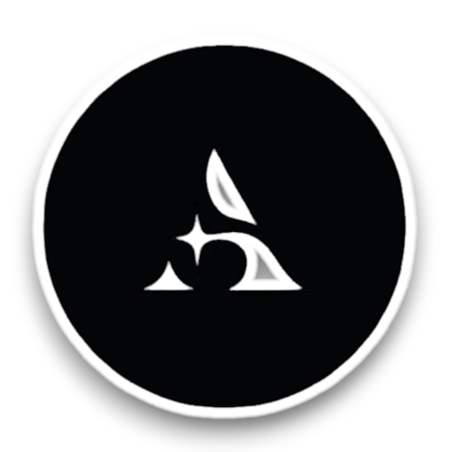

<p align="center">
  
  <h1 align="center">AstroVerse IA</h1>
</p>
This is a machine learning model based on classification that supports the AstroVerse project in providing space recommendations.
<p align="center">
  <h1 align="center">What is AstroVerse?</h1>
</p>
A group of students from the Department of Computer Science at the University of Salerno aims to create a project for a new web application, a social network called AstroVerse. The main purpose of the system is to connect groups of people through virtual groups (spaces), both private and public, where users can share posts and ideas on a topic chosen by the channel creator. Unlike other common social networks where topics are often generic and treated superficially, with users frequently sharing low-quality posts, AstroVerse encourages content creation by rewarding originality, quality, and creativity. Furthermore, the system, through the use of spaces dedicated to specific and focused topics, helps to avoid ambiguity in the information being shared.


## Setup

 1. Create python virtual enviroment
```python
python -m venv .venv
```
 2. Active python virtual enviroment
```python
.venv\Scripts\activate
```
3. Install all requirements from requirements.txt
```python
pip install -r requirements.txt
```
## Start Project
For start Django server execute this command
```bash
cd ia_backend
```
```python
python manage.py runserver
```
